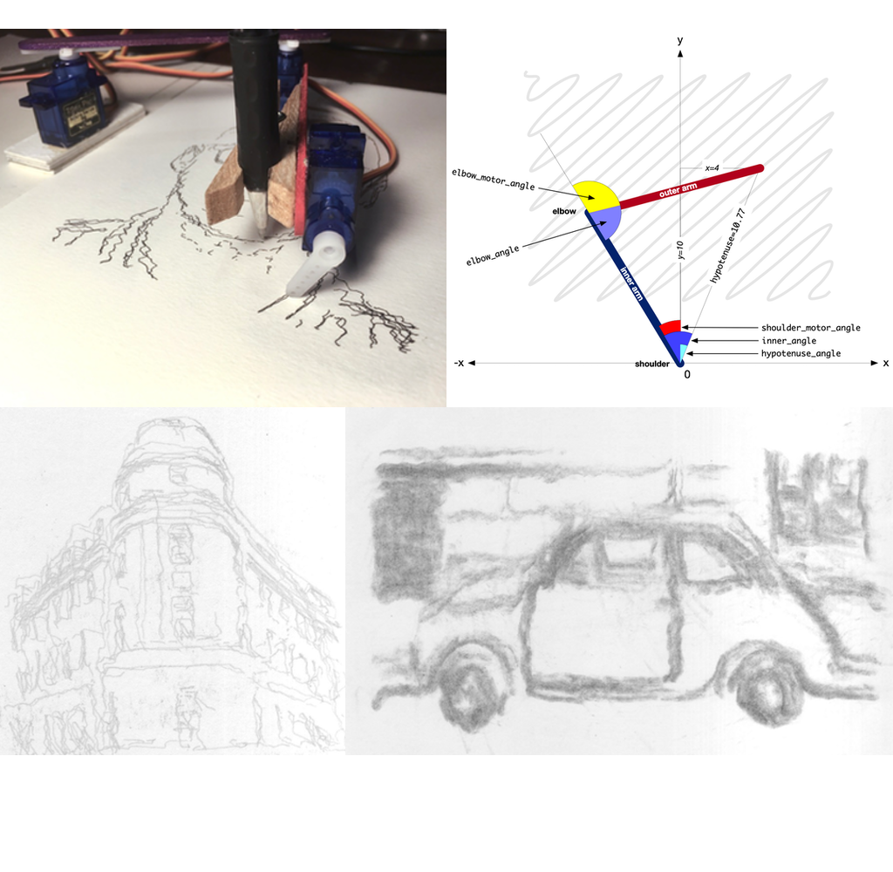

BrachioGraph - the cheapest, simplest possible pen-plotter
==========================================================

`BrachioGraph <https://www.brachiograph.art/>`_ is an ultra-cheap (total cost of materials: ~€14) plotter that can be built with minimal skills.

At its heart is a Raspberry Pi Zero and some relatively simple custom software, driving three servo motors.

The mechanical hardware can be built from nothing but two sticks, a pen or pencil and some glue. No tools are required.

Almost everything required can be found in a desk or kitchen drawer. The entire device can be built with no special skills in about an hour.

`BrachioGraph can be found on Twitter <https://twitter.com/BrachioGraph>`_.

Documentation
-------------

`Complete documentation for the project, with detailed instructions on how to build and use it <https://www.brachiograph.art/>`_
