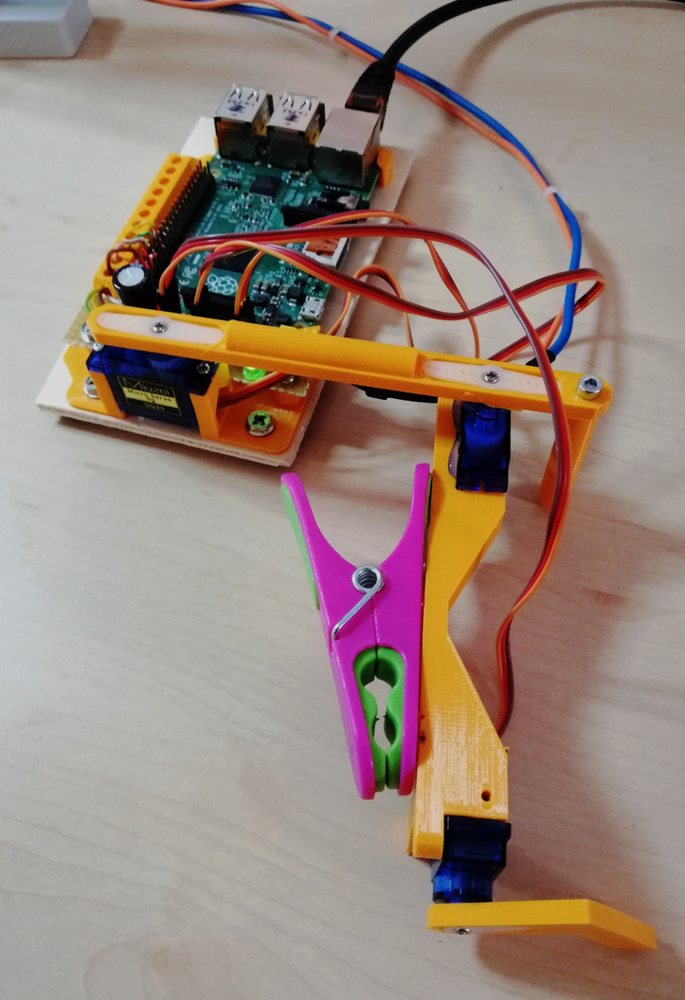

.. _build:

Build the plotter
=================

Components and materials
------------------------

You'll need:

* a Raspberry Pi
* three servo motors
* two arms
* jumper wires and GPIO pin header to connect the Pi to the servos
* other small items mentioned below (such as a clothes-peg) depending on exactly how you build the machine.

You'll also need some strong adhesive.

See :ref:`the hardware section <hardware>` for details on what components and materials to obtain.

If you are using SG90 motors as suggested, arms of about 8cm are suitable for drawing an area approximately 14cm wide
by 9cm high. This fits well onto a sheet of A5 paper. (See :ref:`understand_plotter_geometry` and
:ref:`optimise-geometry`.)

3D printed version
------------------
For people with a 3D printer there are also `parts for 3D printing available <https://www.thingiverse.com/thing:4295302>`_

Assembly
-----------------

The shoulder motor
~~~~~~~~~~~~~~~~~~

Attach a servo to the base, either by gluing it or attaching it some other way; two ways are shown below. It needs to
be raised a little above the level of the base.

.. image:: /images/shoulder-servo-mounting.jpg
   :alt: 'Options for mounting the shoulder servo'

The inner arm
~~~~~~~~~~~~~

Glue the servo horns to the inner arm, so that the centres of rotation are about 8cm (or whatever you have selected)
apart.

.. image:: /images/arm.jpg
   :alt: 'the horns glued to the inner arm'

The outer arm, clothes-peg and servos
~~~~~~~~~~~~~~~~~~~~~~~~~~~~~~~~~~~~~

Glue a servo and a clothes-peg to the outer arm, so that a pen in the clothes-peg and the centre of rotation of the arm
will also be the appropriate distance apart. Glue the final servo in such a position that its horn can rotate safely,
and will be able to lift the pen clear of the paper. (See also an :ref:`alternative arrangement <no-clothes-peg>`.)

.. image:: /images/outer-arm.jpg
   :alt: 'The outer arm, clothes-peg and servos'

The assembled BrachioGraph
~~~~~~~~~~~~~~~~~~~~~~~~~~

.. image:: /images/brachiograph-top-view-arms.jpg
   :alt: 'Arms and motors'
   :class: 'main-visual'

The system uses centimetres as its basic unit of length.

Measure precisely the distance between the axis of the two servo horns on the upper arm (``inner_arm``), and the
distance between the axis of the servo motor and the pen on the other (``outer_arm``). You'll need these values shortly.
